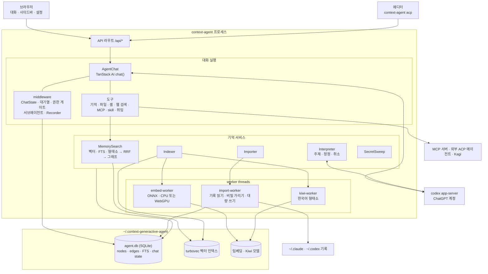
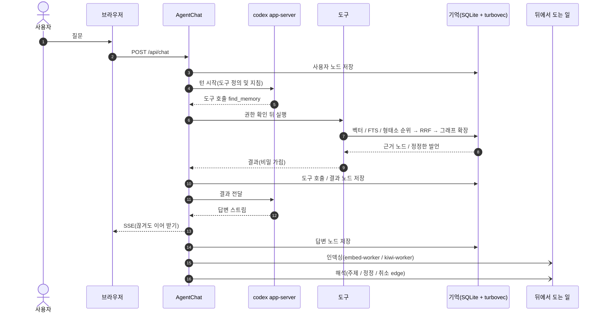
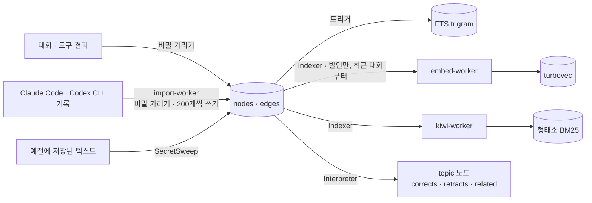

# Context Generactive Agent

세션과 프로젝트를 넘어 대화를 기억하고, 근거를 따라갈 수 있는 로컬 에이전트입니다.

버전을 고정한 codex app-server를 통해 ChatGPT 계정으로 모델을 사용합니다. 기억은 로컬 SQLite에 저장하고, 벡터 임베딩과 Kiwi 형태소 분석, 그래프로 찾습니다.

실행 파일 `context-agent` 하나로 배포합니다. 파일을 실행하면 웹 앱과 에이전트가 함께 시작됩니다.

설정 파일 위치: `~/.context-generactive-agent`

- [apps/agent](apps/agent/README.md): 웹 앱(UI, API 라우트), 실행 방법
- [packages/memory-agent](packages/memory-agent/README.md): 기억, 도구, 권한, codex 연결
- [docs/decisions.md](docs/decisions.md): 확정한 제품과 설계 결정
- [docs/building.md](docs/building.md): 플랫폼별 빌드와 릴리스 가이드 (macOS와 Windows 릴리스, Linux 로컬 빌드)

## 아키텍처

웹 서버와 에이전트는 한 프로세스(`context-agent`)에서 실행됩니다. Effect `Layer`로 서비스를 조립하고 `ManagedRuntime` 하나로 관리합니다. 임베딩과 형태소 분석, 다른 에이전트의 기록 가져오기는 worker thread에서 처리합니다.



### 대화 루프

사용자 발언과 모델 답변, 도구 호출과 결과를 원문 그대로 노드에 저장합니다. 노드는 구조 edge(`next`, `reply`, `calls`, `returns`, `touches`)로 연결됩니다. 벡터 색인에는 발언만 넣고, 도구 노드는 글자 검색과 연결된 edge로 찾습니다.



### 기억이 쌓이는 길



## 동작 예시

데모용 프로젝트(`shop-api`)와 Claude Code 대화 두 개로 녹화했습니다.

설정의 "가져오기"를 켜면 Claude Code 기록을 읽어 노드로 옮기고, 대화가 있던 폴더를 프로젝트로 등록합니다. 가져온 발언은 백그라운드에서 임베딩합니다. 실행 방식은 "기억" 탭에서 확인할 수 있으며, 메모리가 16GB 이상이고 WebGPU를 사용할 수 있으면 GPU에서 처리합니다. 도구 호출과 결과는 임베딩하지 않고 글자 검색과 형태소 검색과 발언에서 이어진 edge로 찾습니다. 가져온 대화는 도구 호출과 결과까지 그대로 열립니다.


새 대화에서 예전 결정을 물으면 모델이 `find_memory`로 가져온 대화를 찾고, `read_evidence`, `trace_evidence`로 원문과 근거를 따라가 답합니다. 배포 일정은 나중에 바뀐 결정(화요일 → 목요일)으로 답합니다.


## Development

개발 준비 상태를 확인합니다:

```bash
vp run ready
```

테스트를 실행합니다:

```bash
vp run -r test
```

turbovec 네이티브 애드온을 포함해 모노레포를 의존성 순서로 빌드합니다. Rust가 필요하며, 빌드 결과는 Vite Task가 캐시합니다:

```bash
pnpm build   # or: vp run build
```

개발 서버를 실행합니다. 호스트와 포트 옵션은 [apps/agent](apps/agent/README.md)를 참고하세요:

```bash
vp run dev
```

현재 기기용 실행 파일을 빌드하고 확인합니다. Node 버전은 `.node-version`에 지정된 26.8.2입니다:

```bash
cd apps/agent
vp run package
vp run smoke-package
```
