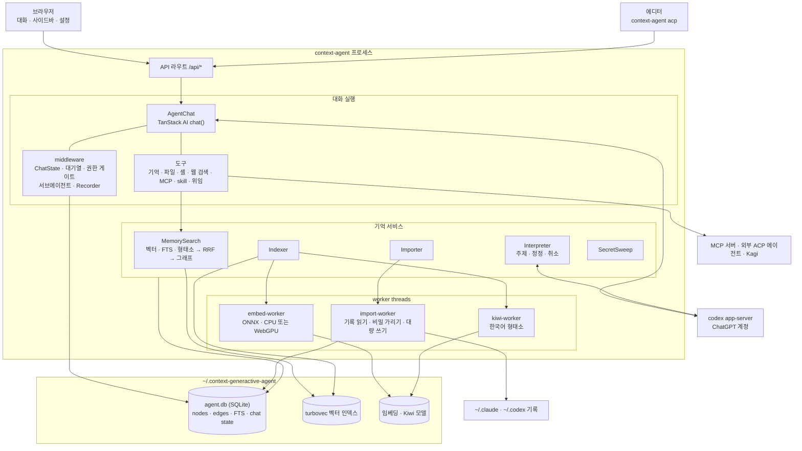
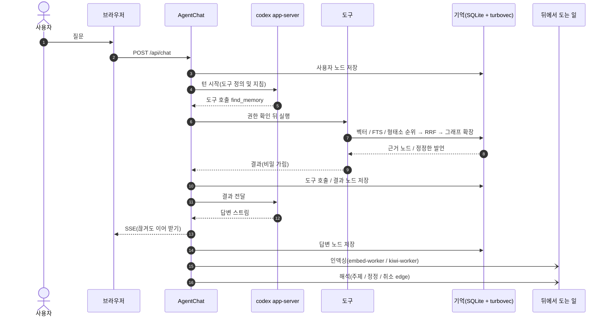
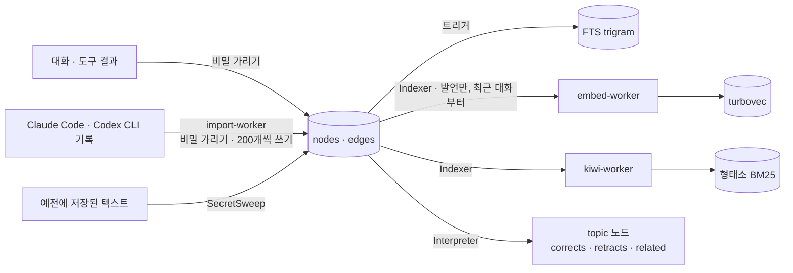

# Context Generactive Agent

이전에 나눈 대화와 작업 내용을 기억하는 로컬 AI 에이전트입니다. 지난번에 어디까지 했는지 다시 설명하지 않아도, 필요한 기록을 찾아 작업을 이어갑니다.

ChatGPT 또는 Claude 계정을 연결해 사용할 수 있습니다. 앱과 기억은 내 컴퓨터에서 실행되고 저장됩니다.

## 💡 이런 일을 할 수 있습니다

- **지난 작업 이어가기** — 며칠 뒤 새 대화를 시작해도 이전에 정한 방향, 시도한 방법, 남은 일을 찾아서 계속합니다.
- **여러 프로젝트를 함께 기억하기** — 프로젝트마다 대화와 작업 내용을 나누어 관리하고, 필요하면 다른 프로젝트에서 했던 비슷한 작업도 찾아봅니다.
- **코딩 작업 맡기기** — 파일을 읽고 수정하며, 테스트를 실행하고, 문제가 생기면 원인을 찾아 고칩니다.
- **여러 AI와 함께 일하기** — 큰 작업을 다른 AI에게 나누어 맡기고 진행 상황과 결과를 한곳에서 확인합니다.
- **기존 기록 가져오기** — Claude Code와 Codex CLI에서 진행하던 대화를 가져와 이곳에서 이어갈 수 있습니다.
- **내 컴퓨터에서 관리하기** — 대화와 기억을 외부 메모리 서비스가 아닌 내 컴퓨터에 보관합니다.

## ✨ 주요 기능

- **🧠 대화를 기억하는 AI** — 이전 대화에서 정한 내용과 작업 결과를 기억합니다. 새 대화를 시작하거나 앱을 다시 열어도 처음부터 설명할 필요가 없습니다.

- **🔎 근거까지 확인할 수 있는 기억** — AI가 과거 내용을 기억해 냈을 때, 실제로 누가 무슨 말을 했고 어떤 작업에서 나온 내용인지 원문까지 거슬러 확인할 수 있습니다.

- **🔄 바뀐 결정도 제대로 반영** — “아까 말한 방법 말고 다른 방법으로 하자”처럼 결정을 바꾸면 새 내용을 우선합니다. 예전 기록을 몰래 지우지 않아 무엇이 어떻게 바뀌었는지도 알 수 있습니다.

- **🗂️ 프로젝트를 넘나드는 도움** — 지금 작업과 관련된 경험이 다른 프로젝트에 있으면 함께 찾아봅니다. 섞이고 싶지 않은 프로젝트는 검색 대상에서 제외할 수 있습니다.

- **💬 오래 이어지는 대화** — 대화가 길어져도 중요한 흐름을 유지하고, 연결이 잠시 끊겨도 진행 중인 답변을 다시 이어 받습니다. AI가 답하는 동안 다음 요청을 미리 적어 둘 수도 있습니다.

- **🛠️ 말로 요청하는 실제 작업** — “이 오류를 고쳐줘”, “테스트를 돌려줘”, “이 기능을 추가해줘”라고 요청하면 프로젝트를 살펴보고 파일 수정과 검증까지 진행합니다.

- **✅ 실행 전 확인과 권한 설정** — 중요한 작업은 실행 전에 내용을 보여주고 허락을 받습니다. 프로젝트마다 항상 확인할지, 안전한 작업은 자동으로 허용할지 선택할 수 있습니다.

- **🤝 여러 AI에게 작업 나누기** — 조사, 구현, 검토처럼 나누기 좋은 일을 별도의 AI에게 동시에 맡길 수 있습니다. 외부 코딩 에이전트도 연결해 같은 화면에서 대화하고 승인할 수 있습니다.

- **🌐 필요한 정보 찾아보기** — 웹 검색을 연결하면 최신 문서나 자료를 찾아 작업에 활용합니다.

- **🧩 원하는 기능 연결하기** — MCP 서버와 skill을 추가해 캘린더, 문서, 사내 도구처럼 필요한 기능과 작업 방식을 연결할 수 있습니다.

- **📥 기존 AI 작업 그대로 가져오기** — Claude Code와 Codex CLI의 과거 대화를 불러옵니다. 대화뿐 아니라 당시 실행했던 작업과 결과도 함께 보존합니다.

- **🔐 로컬 중심의 데이터 관리** — 대화, 프로젝트 설정, 기억을 내 컴퓨터에 저장합니다. 가져온 기록에서 비밀번호나 API 키로 보이는 내용은 저장 전에 가립니다.

- **🖼️ 이미지와 함께 대화하기** — 사용하는 AI 모델이 이미지를 지원하면 스크린샷이나 참고 이미지를 첨부해 질문할 수 있습니다. 사용 환경이 지원하는 경우 이미지 생성도 사용할 수 있습니다.

- **🖥️ 웹과 에디터에서 같은 작업 이어가기** — 브라우저에서 사용하다가 지원되는 코드 에디터로 옮겨도 같은 프로젝트, 대화, 기억을 그대로 사용합니다.

설정 파일 위치: `~/.context-generactive-agent`

- [apps/agent](apps/agent/README.md): 웹 앱(UI, API 라우트), 실행 방법
- [packages/memory-agent](packages/memory-agent/README.md): 기억, 도구, 권한, codex 연결
- [docs/decisions.md](docs/decisions.md): 확정한 제품과 설계 결정
- [docs/building.md](docs/building.md): 플랫폼별 빌드와 릴리스 가이드 (macOS와 Windows 릴리스, Linux 로컬 빌드)

## 아키텍처

웹 서버와 에이전트는 한 프로세스(`context-agent`)에서 실행됩니다. Effect `Layer`로 서비스를 조립하고 `ManagedRuntime` 하나로 관리합니다. 임베딩과 형태소 분석, 다른 에이전트의 기록 가져오기는 worker thread에서 처리합니다.



### 대화 루프

사용자 발언과 모델 답변, 도구 호출과 결과를 원문 그대로 노드에 저장합니다. 노드는 구조 edge(`next`, `reply`, `calls`, `returns`, `touches`)로 연결됩니다. 벡터 색인에는 발언만 넣고, 도구 노드는 글자 검색과 연결된 edge로 찾습니다.



### 기억이 쌓이는 길



## 동작 예시

데모용 프로젝트(`shop-api`)와 Claude Code 대화 두 개로 녹화했습니다.

설정의 "가져오기"를 켜면 Claude Code 기록을 읽어 노드로 옮기고, 대화가 있던 폴더를 프로젝트로 등록합니다. 가져온 발언은 백그라운드에서 임베딩합니다. 실행 방식은 "기억" 탭에서 확인할 수 있으며, 메모리가 16GB 이상이고 WebGPU를 사용할 수 있으면 GPU에서 처리합니다. 도구 호출과 결과는 임베딩하지 않고 글자 검색과 형태소 검색과 발언에서 이어진 edge로 찾습니다. 가져온 대화는 도구 호출과 결과까지 그대로 열립니다.


새 대화에서 예전 결정을 물으면 모델이 `find_memory`로 가져온 대화를 찾고, `read_evidence`, `trace_evidence`로 원문과 근거를 따라가 답합니다. 배포 일정은 나중에 바뀐 결정(화요일 → 목요일)으로 답합니다.


## Development

개발 준비 상태를 확인합니다:

```bash
vp run ready
```

테스트를 실행합니다:

```bash
vp run -r test
```

turbovec 네이티브 애드온을 포함해 모노레포를 의존성 순서로 빌드합니다. Rust가 필요하며, 빌드 결과는 Vite Task가 캐시합니다:

```bash
pnpm build   # or: vp run build
```

개발 서버를 실행합니다. 호스트와 포트 옵션은 [apps/agent](apps/agent/README.md)를 참고하세요:

```bash
vp run dev
```

현재 기기용 실행 파일을 빌드하고 확인합니다. Node 버전은 `.node-version`에 지정된 26.8.2입니다:

```bash
cd apps/agent
vp run package
vp run smoke-package
```
