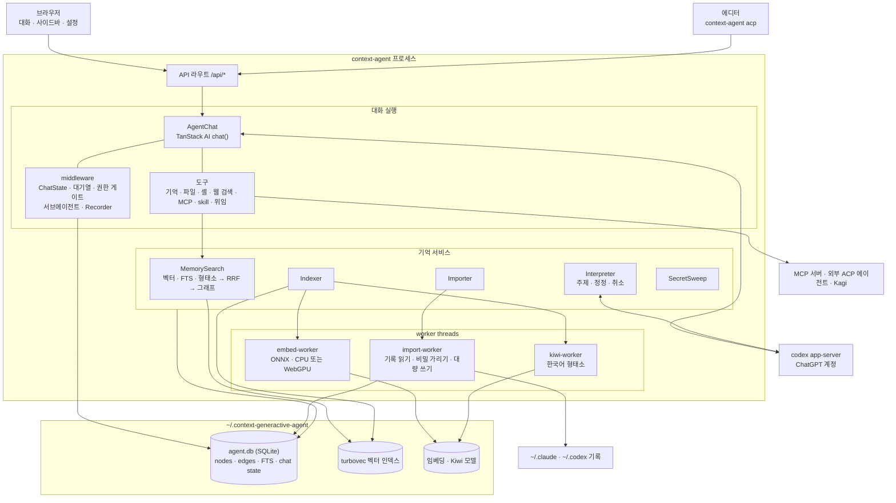
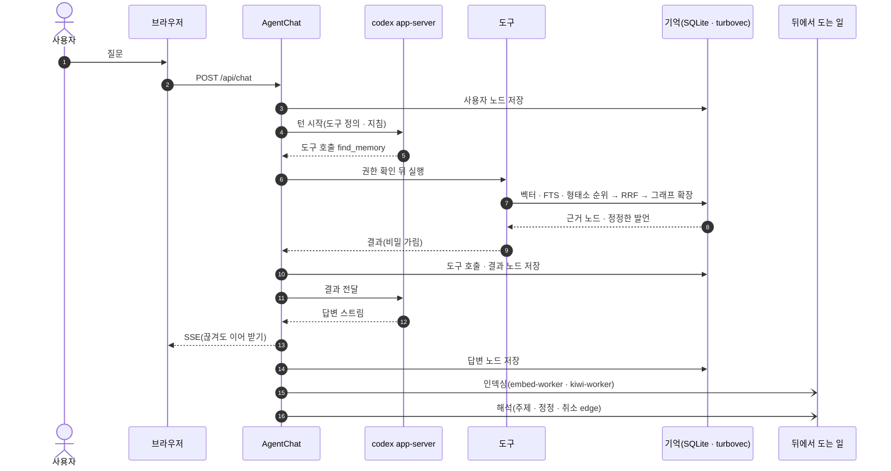
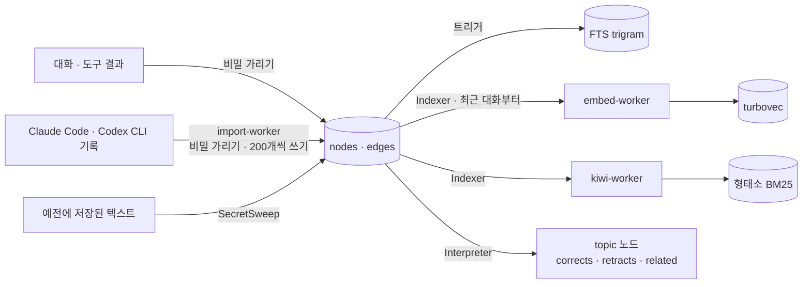
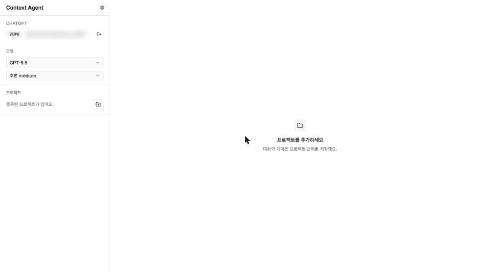
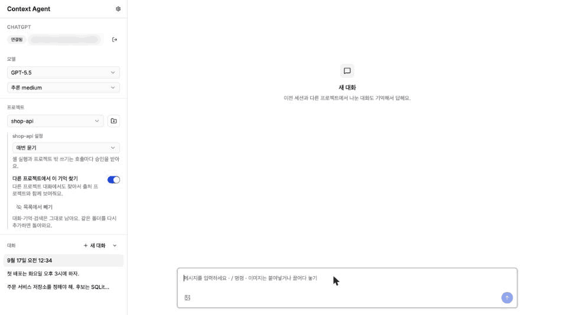

# Context Generactive Agent

세션·프로젝트를 넘어 대화를 기억하고, 근거를 따라갈 수 있는 로컬 에이전트입니다.
ChatGPT 계정(버전을 고정한 codex app-server)으로 모델을 쓰고, 기억은 로컬 SQLite·임베딩·Kiwi 형태소·그래프로 저장하고 찾습니다.
실행 파일 `context-agent` 하나로 배포하며, 실행하면 웹 앱과 에이전트가 함께 뜹니다. 필요한 파일(codex 116 MB, 임베딩·Kiwi 모델 약 230 MB)은 처음 쓸 때 `~/.context-generactive-agent` 아래로 받습니다.

- [apps/agent](apps/agent/README.md): 웹 앱(UI, API 라우트), 실행 방법
- [packages/memory-agent](packages/memory-agent/README.md): 기억·도구·권한·codex 연결
- [docs/decisions.md](docs/decisions.md): 확정한 제품·설계 결정
- [docs/building.md](docs/building.md): 플랫폼별 빌드·릴리스 가이드 (macOS·Windows 릴리스, Linux 로컬 빌드)

## 아키텍처

한 프로세스(`context-agent`) 안에 웹 서버와 에이전트가 함께 돕니다. 서비스는 Effect `Layer`로 조립한 `ManagedRuntime` 하나에 있고, CPU를 오래 쓰는 일(임베딩, 형태소 분석, 다른 에이전트 기록 가져오기)은 worker thread에서 돕니다.



### 대화 한 턴

사용자 발언과 모델의 답, 도구 호출과 결과는 모두 원문 그대로 노드가 되고, 구조 edge(`next`, `reply`, `calls`, `returns`, `touches`)로 이어집니다. 검색·인덱싱·해석은 답변을 막지 않도록 뒤에서 돕니다.



### 기억이 쌓이는 길



## 동작 예시

데모용 프로젝트(`shop-api`)와 Claude Code 대화 두 개로 녹화했습니다.

**다른 에이전트의 대화 가져오기.** 설정의 "가져오기"를 켜면 Claude Code 기록을 읽어 노드로 옮기고, 대화가 있던 폴더를 프로젝트로 등록합니다. 옮긴 노드는 뒤에서 임베딩됩니다("기억" 탭: 메모리 16GB 이상이고 WebGPU가 되면 GPU에서 돕니다). 가져온 대화는 도구 호출과 결과까지 그대로 열립니다.



**예전 결정 기억해 내기.** 새 대화에서 물으면 모델이 `find_memory`로 가져온 대화를 찾고, `read_evidence`·`trace_evidence`로 원문과 근거를 따라가 답합니다. 배포 일정은 나중에 바뀐 결정(화요일 → 목요일)으로 답합니다.



## Development

- Check everything is ready:

```bash
vp run ready
```

- Run the tests:

```bash
vp run -r test
```

- Build the monorepo in dependency order, turbovec's native addon included (needs Rust; cached by Vite Task):

```bash
pnpm build   # or: vp run build
```

- Run the development server (see [apps/agent](apps/agent/README.md) for host/port options):

```bash
vp run dev
```

- Build the executable for this machine and check it (Node 26.8.2 from `.node-version`):

```bash
cd apps/agent
vp run package
vp run smoke-package
```
